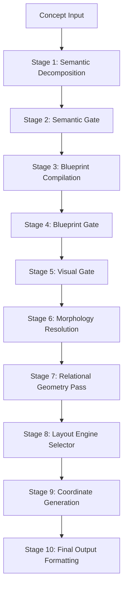

# ConceptCraftAI: Architecture & Pipeline Flow

This document explains how ConceptCraftAI transforms a simple text concept (e.g., "Animal Cell") into a semantically meaningful collections of 3D coordinates.

## The 10-Stage Pipeline

The system follows a strict linear pipeline where each stage has a clear responsibility and follows a rigid data contract.

### Module Roles

| Module | Filename | Role |
| :--- | :--- | :--- |
| **Entry Point** | `main.py` | Orchestrates the session, manages the loop, and triggers stages. |
| **LLM Interface** | `generator.py` | Handles API calls to Gemini or fallback local models (Ollama). |
| **Prompt Storage** | `prompts.py` | Contains the logic-heavy templates for Stage 1 and Stage 3. |
| **Data Contract** | `pipeline_contract.py` | The "law" of the system. Defines which fields and enums are valid. |
| **Schema** | `schema.py` | Technical definitions (dataclasses) for internal data objects. |
| **Semantic Validator** | `validators/semantic_gate.py` | Audits the LLM's Stage 1 output for safety and logic errors. |
| **Blueprint Validator** | `validators/blueprint_gate.py` | Normalizes relations and repairs missing component metadata. |
| **Topology Scorer** | `validators/visual_gate.py` | Scores the blueprint's geometric viability. |
| **Morphology Engine** | `morphology_resolver.py` | Resolves the "look and feel" (e.g., Biological vs Architectural). |
| **Relation Stylist** | `relational_geometry.py` | Determines how relations look (arrows, enclosures, colors). |
| **Layout Manager** | `engine.py` | Selects and executes the correct mathematical layout algorithm. |
| **Spatial Refiner** | `spatial_passes.py` | Runs post-layout passes (stacking, containment, vertical hints). |
| **Layout Algorithms** | `layouts.py` | The math powering Radial, Hierarchical, and Network layouts. |
| **Morphology Mapper** | `layout_morphology_bridge.py`| Connects Morphology Families to specific layout parameters. |

### Data Flow (The Contract)

Stages communicate via the `pipeline_contract.py`. If a stage receives data that violates the contract (e.g., an invalid category or missing field), the `validate_incoming` tool logs a clear warning, allowing for "fail-fast" debugging.

1. **Stage 1 (Raw Semantic):** Raw concept breakdown (entities + relations).
2. **Stage 3 (Full Blueprint):** Entities assigned shapes, roles, results, and patterns.
3. **Stage 6 (Resolved Blueprint):** Identity added (e.g., `morphology_family: nested_membrane`).
4. **Stage 9 (Layout Output):** Final list of X, Y, Z coordinates and refined scales.
